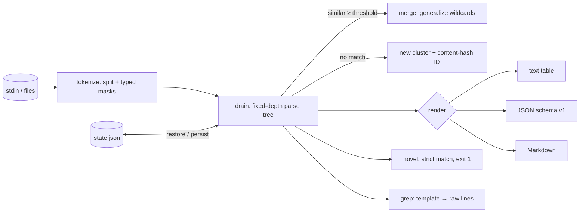

# logloom

[English](README.md) | [中文](README.zh.md) | [日本語](README.ja.md)

[](LICENSE) [](go.mod) [](CHANGELOG.md)  [](CONTRIBUTING.md)

**logloom：生ログ行をテンプレートへクラスタリングするオープンソース・依存ゼロのストリーミング CLI——100 万行の非構造ログが本来の 50 パターンに収束し、件数を数え、ID は安定、未知パターンには終了コードで警報を鳴らす。**


```bash
git clone https://github.com/JaydenCJ/logloom && cd logloom
go build -o logloom ./cmd/logloom    # single static binary, stdlib only
```

> プレリリース：v0.1.0 はまだどのパッケージレジストリにも公開していません。上記のとおりソースからビルドしてください（Go ≥1.22 なら可）。

## なぜ logloom？

レガシーサービスのログには誰も構造を与えておらず、最初の率直な問い——*この中に実際何があるのか？*——への答えは驚くほど貧弱です。`sort | uniq -c` はバイト単位で同一の行しか数えられず、行ごとにタイムスタンプがあれば全行が「ユニーク」になります。drain3 は正しいアルゴリズム（Drain テンプレートマイニング）の実装ですが Python ライブラリです：スクリプトを書き、パッケージツリーをインストールし、状態クラスを管理して初めて最初のテンプレートが見えます。grep は探すパターンを事前に知っていることが前提です。logloom はこのアルゴリズムをストリームフィルタにしました：100 万行を単一の静的バイナリに流し込めば、収束先の 50 テンプレートが返ってきます。それぞれに件数、型付きの骨格（`<time> INFO http request method=<*> path=<*> status=<num> latency=<dur>`）、そして内容ハッシュの ID——実行間でもマシン間でも安定、調整も台帳も不要。テンプレートを状態ファイルへ永続化すれば、`logloom novel` はポケベルに優しい異常ゲートになります：サービスが一度も出したことのない形のログを吐いた瞬間、終了コード 1 で警報。

| | logloom | drain3 | LogMine 系 CLI | `sort \| uniq -c` |
|---|---|---|---|---|
| テンプレートマイニング（単なる重複排除でない） | ✅ | ✅ | ✅ | ❌ |
| コード不要のストリーミング CLI | ✅ | ❌ Python ライブラリ | ✅ | ✅ |
| 型付きプレースホルダ（`<ip>`、`<dur>` など） | ✅ | ❌ 正規表現は自作 | ❌ | ❌ |
| 実行間で安定したテンプレート ID | ✅ 内容ハッシュ | ⚠️ 状態ごとの連番 | ❌ | ❌ |
| 終了コード付き未知パターンゲート | ✅ | ❌ | ❌ | ❌ |
| テンプレートから生ログ行を逆引き | ✅ `grep` | ❌ | ❌ | ❌ |
| ランタイム依存 | 0 | Python + パッケージ | Python | 0（組み込み） |

<sub>依存数の確認は 2026-07-13：logloom は Go 標準ライブラリのみを import。drain3 は PyPI から jsonpickle と cachetools を取得し、さらに kafka/redis のオプション extras があります。</sub>

## 特徴

- **ワンパス・定数メモリ** — 固定深さのパースツリー（Drain 流）が各行を O(1) でクラスタリング。100 万行が数秒で流れ、メモリは行数ではなくテンプレート数にのみ比例。
- **型付きマスキング** — タイムスタンプ、数値、IP、UUID、時間、サイズ、16 進、メール、不透明 ID はクラスタリングの*前に*読めるプレースホルダへ。`latency=12ms` と `latency=340ms` は最初から同じもの。
- **ドキュメントのように読めるテンプレート** — `key=value` は値が分岐してもキーを保持（裸のワイルドカードではなく `status=<*>`）、囲み記号もそのまま残る（`(<dur>)`）。
- **安定したテンプレート ID** — `t` + 誕生時テンプレートの SHA-256 先頭 8 桁：同じストリームなら決定的、一般化しても不変、状態ファイル経由で実行をまたいで持続。
- **ベースライン → 新規性ワークフロー** — 正常トラフィックから `learn` で状態ファイルを作り、`novel` は未知の行だけを出力して 1 で終了。`-learn` で各新パターンの警報はちょうど一度きり。
- **3 つの出力形式** — 人間向けの整列テキスト、機械向けの安定 JSON（`schema_version: 1`）、PR に貼れる Markdown 表——すべてバイト単位で決定的。
- **依存ゼロ・完全オフライン** — Go 標準ライブラリのみ。読むのは stdin かファイル、書くのは stdout と指定された状態ファイルだけ。テレメトリなし、ネットワークなし、永久に。

## クイックスタート

```bash
go build -o logloom ./cmd/logloom
./logloom scan examples/sample.log
```

実際に取得した出力——生ログ 200 行、テンプレート 9 個：

```text
logloom — 200 lines → 9 templates

count      %  id         template
   96   48.0  te3225c3f  <time> INFO http request method=<*> path=<*> status=<num> latency=<dur>
   36   18.0  t88a9d32d  <time> INFO cache hit key=user:<num> ttl=<dur>
   22   11.0  t227f99ea  <time> DEBUG db query table=<*> rows=<num> took=<dur>
   16    8.0  t5d5c164d  <time> INFO worker <num> finished job <hex> in <dur>
   12    6.0  t07c89968  <time> INFO cache miss key=user:<num> fetching from origin
    8    4.0  tdf275f47  <time> INFO session started session=<uuid> user=<email>
    4    2.0  te5858e94  <time> WARN retrying request attempt=<num> backoff=<dur>
    4    2.0  tfbcd9445  <time> ERROR upstream timeout host=<ip> after=<dur>
    2    1.0  td4e07695  <time> WARN config reload took longer than expected elapsed=<dur>

200 lines · 9 templates
```

ベースラインを学習し、サービスが一度も出したことのない行を捕まえる（実際の出力）：

```text
$ logloom learn -state baseline.json examples/sample.log
learned 200 lines → 9 templates (9 new) · state written to baseline.json

$ echo "2026-02-04T09:12:45Z ERROR disk write failed device=sda1 err=EIO" | logloom novel -state baseline.json
2026-02-04T09:12:45Z ERROR disk write failed device=sda1 err=EIO
logloom novel: 1 of 1 line matched no baseline template (9 templates known)
$ echo $?
1
```

逆方向も可能——テンプレート ID から生ログ行を取り戻す：

```bash
logloom grep -state baseline.json tfbcd9445 examples/sample.log   # 4 timeout lines
```

## CLI リファレンス

`logloom <scan|learn|novel|grep|version> [flags] [file ...]` — ファイル指定なしなら stdin を読む。flag は位置引数より前に置く。終了コード：0 正常、1 未知行を検出、2 使い方エラー、3 実行時エラー。

| Flag | 既定値 | 効果 |
|---|---|---|
| `-format`（scan） | `text` | `text`、`json`、`markdown` のいずれか |
| `-top`（scan） | 全件 | 最頻出の N テンプレートのみ表示 |
| `-min-count`（scan） | 1 | マッチ数が N 未満のテンプレートを隠す |
| `-state` | — | 状態ファイル：実行前に読み込み、実行後に保存（`learn`/`novel`/`grep` では必須） |
| `-threshold` | `0.5` | テンプレートに合流するために必要な類似度 (0–1] |
| `-depth` | `3` | パースツリーの接頭トークン層数 |
| `-max-children` | `64` | ワイルドカード化までのノードあたり分岐上限 |
| `-no-mask` | オフ | トークンを原文のままクラスタリング（型付きマスキングを省略） |
| `-learn`（novel） | オフ | 未知行をベースラインへ追加：各パターンの警報は一度だけ |
| `-quiet`（novel） | オフ | 要約と終了コードのみ |
| `-invert`（grep） | オフ | そのテンプレートに*属さない*行を出力 |

マスキングのクラス（`<time>`、`<num>`、`<ip>`、`<uuid>`、`<dur>`、`<size>`、`<hex>`、`<email>`、`<id>`）、数字連続のフォールバック、ツリーのチューニングは [docs/template-mining.md](docs/template-mining.md) を参照。

## 検証

このリポジトリに CI はありません。上記の主張はすべてローカル実行で検証しています：

```bash
go test ./...            # 91 deterministic tests, offline, < 5 s
bash scripts/smoke.sh    # end-to-end CLI check, prints SMOKE OK
```

## アーキテクチャ



## ロードマップ

- [x] v0.1.0 — ストリーミング Drain 流マイナー、型付きマスキング、安定内容ハッシュ ID、状態ファイル、`scan`/`learn`/`novel`/`grep`、text/JSON/Markdown レポート、91 テスト + スモークスクリプト
- [ ] `tail -f` モード（`-follow`）：新テンプレートを誕生と同時に出力
- [ ] パラメータ抽出：テンプレートごとに各 `<*>` の背後の値を収集
- [ ] 時間バケット集計（`-buckets 1h`）でテンプレートのドリフトを可視化
- [ ] 複数行レコードの結合（スタックトレースを 1 イベントに）
- [ ] カラー出力（任意）と `-sort first-seen` ビュー

完全なリストは [open issues](https://github.com/JaydenCJ/logloom/issues) へ。

## コントリビュート

Issue・ディスカッション・PR を歓迎します——ローカルのワークフロー（format、vet、テスト、`SMOKE OK`）は [CONTRIBUTING.md](CONTRIBUTING.md) を参照。入門タスクは [good first issue](https://github.com/JaydenCJ/logloom/issues?q=is%3Aissue+is%3Aopen+label%3A%22good+first+issue%22) のラベル付き、設計の議論は [Discussions](https://github.com/JaydenCJ/logloom/discussions) で。

## ライセンス

[MIT](LICENSE)
