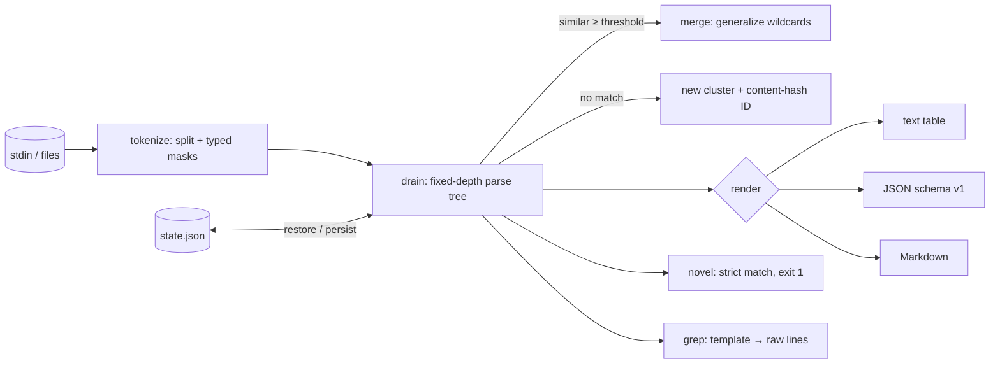

# logloom

[English](README.md) | [中文](README.zh.md) | [日本語](README.ja.md)

[](LICENSE) [](go.mod) [](CHANGELOG.md)  [](CONTRIBUTING.md)

**logloom：an open-source, zero-dependency streaming CLI that clusters raw log lines into templates — a million unstructured lines collapse to the fifty patterns they really are, counted, with stable IDs and an exit-code alarm for patterns never seen before.**


```bash
git clone https://github.com/JaydenCJ/logloom && cd logloom
go build -o logloom ./cmd/logloom    # single static binary, stdlib only
```

> Pre-release: v0.1.0 is not tagged on a package registry yet; build from source as above (any Go ≥1.22).

## Why logloom?

Legacy services write logs nobody structured, and the first honest question — *what is actually in here?* — has surprisingly poor answers. `sort | uniq -c` only counts byte-identical lines, so a timestamp per line means every line is "unique". drain3 implements the right algorithm (Drain template mining) but is a Python library: you write a script, install a package tree, and manage its state classes before seeing a single template. Grep needs you to already know the pattern you are looking for. logloom is the algorithm as a stream filter: pipe a million lines through one static binary and get back the fifty templates they collapse into, each with a count, a typed skeleton (`<time> INFO http request method=<*> path=<*> status=<num> latency=<dur>`), and an ID that is a content hash — stable across runs and machines, no coordination, no registry. Persist the templates to a state file and `logloom novel` becomes a pager-friendly anomaly gate: exit 1 the moment the service logs a shape it has never logged before.

| | logloom | drain3 | LogMine-style CLIs | `sort \| uniq -c` |
|---|---|---|---|---|
| Template mining (not just dedup) | ✅ | ✅ | ✅ | ❌ |
| Zero-code streaming CLI | ✅ | ❌ Python library | ✅ | ✅ |
| Typed placeholders (`<ip>`, `<dur>`, …) | ✅ | ❌ regex you write | ❌ | ❌ |
| Stable template IDs across runs | ✅ content hash | ⚠️ sequential per state | ❌ | ❌ |
| Novel-pattern gate with exit codes | ✅ | ❌ | ❌ | ❌ |
| Pull one template's raw lines back out | ✅ `grep` | ❌ | ❌ | ❌ |
| Runtime dependencies | 0 | Python + packages | Python | 0 (built-in) |

<sub>Dependency counts checked 2026-07-13: logloom imports the Go standard library only; drain3 pulls jsonpickle and cachetools from PyPI plus optional kafka/redis extras.</sub>

## Features

- **One pass, constant memory** — a fixed-depth parse tree (Drain-style) clusters each line in O(1); a million lines stream through in seconds, memory bounded by template count, not line count.
- **Typed masking** — timestamps, numbers, IPs, UUIDs, durations, sizes, hex, emails, and opaque IDs become readable placeholders *before* clustering, so `latency=12ms` and `latency=340ms` were never different.
- **Templates that read like documentation** — `key=value` pairs keep their key when values diverge (`status=<*>`, never a bare wildcard), and wrapping punctuation survives (`(<dur>)`).
- **Stable template IDs** — `t` + 8 hex chars of the birth template's SHA-256: deterministic for the same stream, preserved through generalization, and persistent across runs via the state file.
- **Baseline → novelty workflow** — `learn` a state file from normal traffic, then `novel` prints only never-seen lines and exits 1; `-learn` makes each new pattern alert exactly once.
- **Three output formats** — aligned text for humans, stable JSON (`schema_version: 1`) for machines, Markdown tables for PRs — all byte-deterministic.
- **Zero dependencies, fully offline** — Go standard library only; reads stdin or files, writes stdout and the state file you asked for. No telemetry, no network, ever.

## Quickstart

```bash
go build -o logloom ./cmd/logloom
./logloom scan examples/sample.log
```

Real captured output — 200 raw lines, 9 templates:

```text
logloom — 200 lines → 9 templates

count      %  id         template
   96   48.0  te3225c3f  <time> INFO http request method=<*> path=<*> status=<num> latency=<dur>
   36   18.0  t88a9d32d  <time> INFO cache hit key=user:<num> ttl=<dur>
   22   11.0  t227f99ea  <time> DEBUG db query table=<*> rows=<num> took=<dur>
   16    8.0  t5d5c164d  <time> INFO worker <num> finished job <hex> in <dur>
   12    6.0  t07c89968  <time> INFO cache miss key=user:<num> fetching from origin
    8    4.0  tdf275f47  <time> INFO session started session=<uuid> user=<email>
    4    2.0  te5858e94  <time> WARN retrying request attempt=<num> backoff=<dur>
    4    2.0  tfbcd9445  <time> ERROR upstream timeout host=<ip> after=<dur>
    2    1.0  td4e07695  <time> WARN config reload took longer than expected elapsed=<dur>

200 lines · 9 templates
```

Learn a baseline, then catch the line your service never logged before (real output):

```text
$ logloom learn -state baseline.json examples/sample.log
learned 200 lines → 9 templates (9 new) · state written to baseline.json

$ echo "2026-02-04T09:12:45Z ERROR disk write failed device=sda1 err=EIO" | logloom novel -state baseline.json
2026-02-04T09:12:45Z ERROR disk write failed device=sda1 err=EIO
logloom novel: 1 of 1 line matched no baseline template (9 templates known)
$ echo $?
1
```

And go the other way — from a template ID back to its raw lines:

```bash
logloom grep -state baseline.json tfbcd9445 examples/sample.log   # 4 timeout lines
```

## CLI reference

`logloom <scan|learn|novel|grep|version> [flags] [file ...]` — stdin when no file is given; flags go before positional arguments. Exit codes: 0 ok, 1 novel lines found, 2 usage error, 3 runtime error.

| Flag | Default | Effect |
|---|---|---|
| `-format` (scan) | `text` | `text`, `json`, or `markdown` |
| `-top` (scan) | all | show only the N most frequent templates |
| `-min-count` (scan) | 1 | hide templates matched fewer than N times |
| `-state` | — | state file: loads before, saves after (required for `learn`/`novel`/`grep`) |
| `-threshold` | `0.5` | similarity needed to join a template (0–1] |
| `-depth` | `3` | prefix-token levels in the parse tree |
| `-max-children` | `64` | branches per tree node before wildcarding |
| `-no-mask` | off | cluster on verbatim tokens (skip typed masking) |
| `-learn` (novel) | off | add novel lines to the baseline: alert once per pattern |
| `-quiet` (novel) | off | summary and exit code only |
| `-invert` (grep) | off | print lines that do *not* belong to the template |

Masking classes (`<time>`, `<num>`, `<ip>`, `<uuid>`, `<dur>`, `<size>`, `<hex>`, `<email>`, `<id>`), the digit-run fallback, and tree tuning are documented in [docs/template-mining.md](docs/template-mining.md).

## Verification

This repository ships no CI; every claim above is verified by local runs:

```bash
go test ./...            # 91 deterministic tests, offline, < 5 s
bash scripts/smoke.sh    # end-to-end CLI check, prints SMOKE OK
```

## Architecture



## Roadmap

- [x] v0.1.0 — streaming Drain-style miner, typed masking, stable content-hash IDs, state files, `scan`/`learn`/`novel`/`grep`, text/JSON/Markdown reports, 91 tests + smoke script
- [ ] `tail -f` mode (`-follow`) emitting novel templates as they are born
- [ ] Parameter extraction: collect the values behind each `<*>` per template
- [ ] Time-bucketed counts (`-buckets 1h`) to chart template drift
- [ ] Multi-line record stitching (stack traces as one event)
- [ ] Optional color output and a `-sort first-seen` view

See the [open issues](https://github.com/JaydenCJ/logloom/issues) for the full list.

## Contributing

Issues, discussions and pull requests are welcome — see [CONTRIBUTING.md](CONTRIBUTING.md) for the local workflow (format, vet, tests, `SMOKE OK`). Good entry points are labelled [good first issue](https://github.com/JaydenCJ/logloom/issues?q=is%3Aissue+is%3Aopen+label%3A%22good+first+issue%22), and design questions live in [Discussions](https://github.com/JaydenCJ/logloom/discussions).

## License

[MIT](LICENSE)
