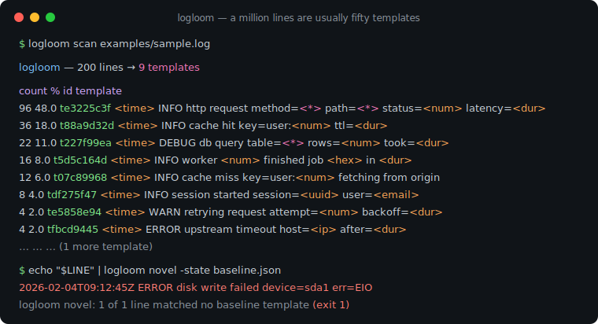
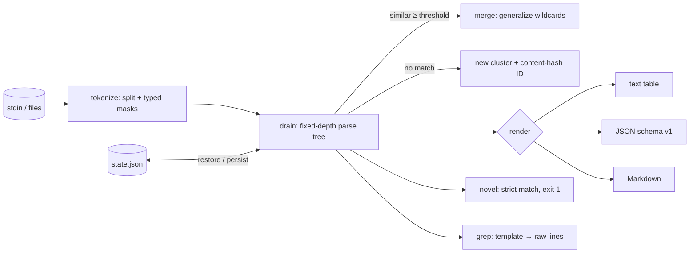

# logloom

[English](README.md) | [中文](README.zh.md) | [日本語](README.ja.md)

[](LICENSE) [](go.mod) [](CHANGELOG.md)  [](CONTRIBUTING.md)

**logloom：开源、零依赖的流式 CLI，把原始日志行聚类成模板——一百万行非结构化日志坍缩为它们真正的那五十种模式，逐一计数，ID 稳定，并用退出码为从未见过的新模式拉响警报。**



```bash
git clone https://github.com/JaydenCJ/logloom && cd logloom
go build -o logloom ./cmd/logloom    # single static binary, stdlib only
```

> 预发布：v0.1.0 尚未发布到任何包仓库；请按上述方式从源码构建（Go ≥1.22 均可）。

## 为什么选 logloom？

遗留服务写下的日志没人给过结构，而最诚实的第一个问题——*这里面到底有什么？*——答案却出奇地糟糕。`sort | uniq -c` 只统计逐字节相同的行，每行一个时间戳就意味着每一行都"独一无二"。drain3 实现了正确的算法（Drain 模板挖掘），但它是一个 Python 库：你得写脚本、装一棵包依赖树、管理它的状态类，才能看到第一个模板。grep 则要求你事先就知道要找的模式。logloom 把算法做成了流过滤器：把一百万行灌进一个静态二进制，得到它们坍缩成的五十个模板，每个都有计数、带类型的骨架（`<time> INFO http request method=<*> path=<*> status=<num> latency=<dur>`），以及一个内容哈希 ID——跨运行、跨机器稳定，无需协调，无需注册表。把模板持久化到状态文件后，`logloom novel` 就成了对呼叫器友好的异常闸门：服务一旦打出从未打过的日志形状，立刻以退出码 1 报警。

| | logloom | drain3 | LogMine 类 CLI | `sort \| uniq -c` |
|---|---|---|---|---|
| 模板挖掘（不止是去重） | ✅ | ✅ | ✅ | ❌ |
| 零代码流式 CLI | ✅ | ❌ Python 库 | ✅ | ✅ |
| 带类型占位符（`<ip>`、`<dur>`……） | ✅ | ❌ 正则自己写 | ❌ | ❌ |
| 跨运行稳定的模板 ID | ✅ 内容哈希 | ⚠️ 按状态顺序编号 | ❌ | ❌ |
| 带退出码的新模式闸门 | ✅ | ❌ | ❌ | ❌ |
| 从模板反查原始日志行 | ✅ `grep` | ❌ | ❌ | ❌ |
| 运行时依赖 | 0 | Python + 若干包 | Python | 0（内置） |

<sub>依赖数核对于 2026-07-13：logloom 只导入 Go 标准库；drain3 从 PyPI 拉取 jsonpickle 与 cachetools，另有可选的 kafka/redis 扩展。</sub>

## 特性

- **单遍扫描、常数内存** — 固定深度解析树（Drain 风格）以 O(1) 聚类每一行；一百万行几秒流完，内存只随模板数增长，与行数无关。
- **带类型掩码** — 时间戳、数字、IP、UUID、时长、字节大小、十六进制、邮箱和不透明 ID 在聚类*之前*就变成可读占位符，`latency=12ms` 和 `latency=340ms` 从一开始就不算不同。
- **模板读起来像文档** — `key=value` 对在值分歧时保留键名（是 `status=<*>`，绝不是光秃秃的通配符），包裹的标点也原样保留（`(<dur>)`）。
- **稳定的模板 ID** — `t` + 模板诞生时 SHA-256 的前 8 位十六进制：同一数据流结果确定，泛化后不变，借助状态文件跨运行持久。
- **基线 → 新颖性工作流** — 用正常流量 `learn` 出状态文件，`novel` 只打印从未见过的行并以 1 退出；`-learn` 让每个新模式恰好报警一次。
- **三种输出格式** — 给人看的对齐文本、给机器读的稳定 JSON（`schema_version: 1`）、贴 PR 用的 Markdown 表格——全部字节级确定。
- **零依赖、完全离线** — 仅 Go 标准库；读 stdin 或文件，写 stdout 和你指定的状态文件。永无遥测，永不联网。

## 快速上手

```bash
go build -o logloom ./cmd/logloom
./logloom scan examples/sample.log
```

真实捕获的输出——200 行原始日志，9 个模板：

```text
logloom — 200 lines → 9 templates

count      %  id         template
   96   48.0  te3225c3f  <time> INFO http request method=<*> path=<*> status=<num> latency=<dur>
   36   18.0  t88a9d32d  <time> INFO cache hit key=user:<num> ttl=<dur>
   22   11.0  t227f99ea  <time> DEBUG db query table=<*> rows=<num> took=<dur>
   16    8.0  t5d5c164d  <time> INFO worker <num> finished job <hex> in <dur>
   12    6.0  t07c89968  <time> INFO cache miss key=user:<num> fetching from origin
    8    4.0  tdf275f47  <time> INFO session started session=<uuid> user=<email>
    4    2.0  te5858e94  <time> WARN retrying request attempt=<num> backoff=<dur>
    4    2.0  tfbcd9445  <time> ERROR upstream timeout host=<ip> after=<dur>
    2    1.0  td4e07695  <time> WARN config reload took longer than expected elapsed=<dur>

200 lines · 9 templates
```

先学出基线，再抓住服务从未打过的那一行（真实输出）：

```text
$ logloom learn -state baseline.json examples/sample.log
learned 200 lines → 9 templates (9 new) · state written to baseline.json

$ echo "2026-02-04T09:12:45Z ERROR disk write failed device=sda1 err=EIO" | logloom novel -state baseline.json
2026-02-04T09:12:45Z ERROR disk write failed device=sda1 err=EIO
logloom novel: 1 of 1 line matched no baseline template (9 templates known)
$ echo $?
1
```

也可以反过来——从模板 ID 找回它的原始日志行：

```bash
logloom grep -state baseline.json tfbcd9445 examples/sample.log   # 4 timeout lines
```

## CLI 参考

`logloom <scan|learn|novel|grep|version> [flags] [file ...]` — 不给文件时读 stdin；flag 要放在位置参数之前。退出码：0 正常，1 发现新行，2 用法错误，3 运行时错误。

| Flag | 默认值 | 作用 |
|---|---|---|
| `-format`（scan） | `text` | `text`、`json` 或 `markdown` |
| `-top`（scan） | 全部 | 只显示最频繁的 N 个模板 |
| `-min-count`（scan） | 1 | 隐藏匹配次数少于 N 的模板 |
| `-state` | — | 状态文件：运行前加载、运行后保存（`learn`/`novel`/`grep` 必填） |
| `-threshold` | `0.5` | 并入模板所需的相似度 (0–1] |
| `-depth` | `3` | 解析树的前缀 token 层数 |
| `-max-children` | `64` | 每个树节点通配化之前的分支上限 |
| `-no-mask` | 关 | 按原样 token 聚类（跳过带类型掩码） |
| `-learn`（novel） | 关 | 把新行加入基线：每个模式只报警一次 |
| `-quiet`（novel） | 关 | 只输出摘要和退出码 |
| `-invert`（grep） | 关 | 打印*不*属于该模板的行 |

掩码类别（`<time>`、`<num>`、`<ip>`、`<uuid>`、`<dur>`、`<size>`、`<hex>`、`<email>`、`<id>`）、数字段回退规则与树的调优见 [docs/template-mining.md](docs/template-mining.md)。

## 验证

本仓库不带 CI；以上每一条主张都由本地运行验证：

```bash
go test ./...            # 91 deterministic tests, offline, < 5 s
bash scripts/smoke.sh    # end-to-end CLI check, prints SMOKE OK
```

## 架构



## 路线图

- [x] v0.1.0 — 流式 Drain 风格挖掘器、带类型掩码、稳定内容哈希 ID、状态文件、`scan`/`learn`/`novel`/`grep`、text/JSON/Markdown 报告、91 个测试 + 冒烟脚本
- [ ] `tail -f` 模式（`-follow`），新模板一诞生就输出
- [ ] 参数提取：按模板收集每个 `<*>` 背后的取值
- [ ] 按时间分桶计数（`-buckets 1h`），绘制模板漂移曲线
- [ ] 多行记录拼接（堆栈跟踪算一个事件）
- [ ] 可选彩色输出与 `-sort first-seen` 视图

完整列表见 [open issues](https://github.com/JaydenCJ/logloom/issues)。

## 贡献

欢迎 issue、讨论与 PR——本地工作流（format、vet、测试、`SMOKE OK`）见 [CONTRIBUTING.md](CONTRIBUTING.md)。入门任务标记为 [good first issue](https://github.com/JaydenCJ/logloom/issues?q=is%3Aissue+is%3Aopen+label%3A%22good+first+issue%22)，设计讨论请去 [Discussions](https://github.com/JaydenCJ/logloom/discussions)。

## 许可证

[MIT](LICENSE)
